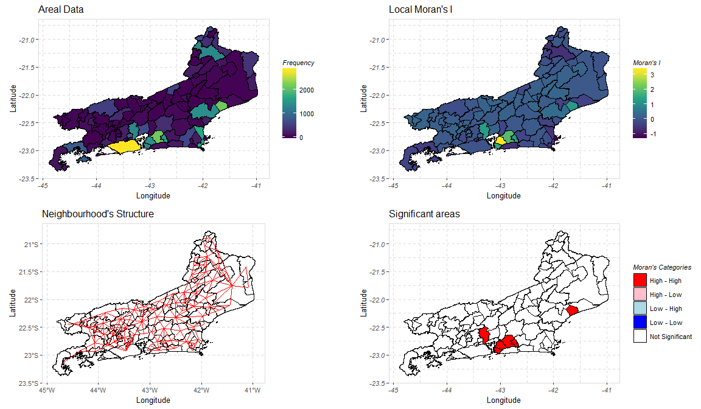
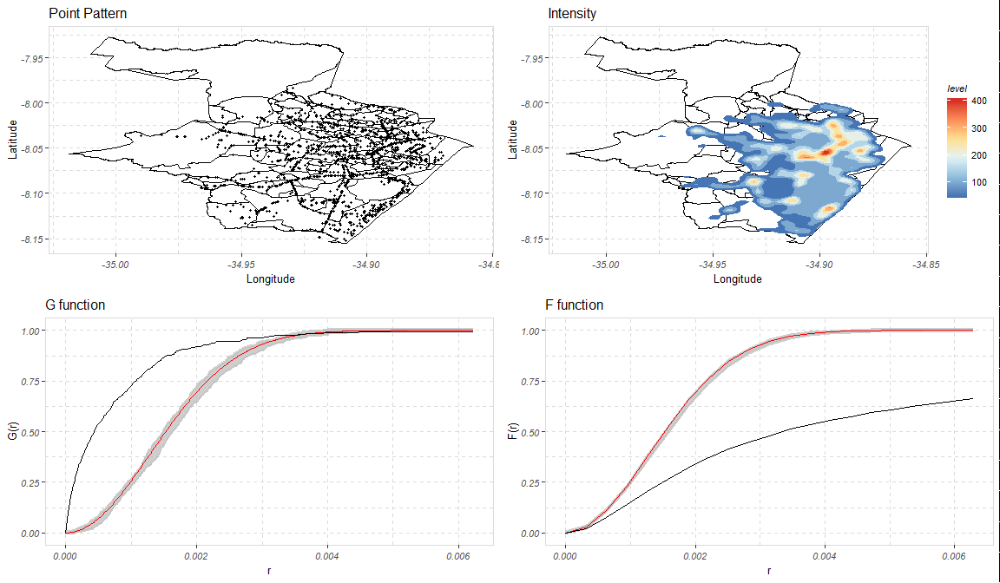

qspatial
========

<!-- badges: start -->
<!-- badges: end -->
qspatial is a spatial statistics package for R which made with an user-friendly approach to allow users who are new to R or spatial statistics to visualize and analyze spatial data. The package utilizes spatstat and spdep functions to do the spatial analysis and ggplot2 to create all the resulting maps and plots.

The current version of the package has functions for point pattern and areal data. The package's functions uses what is considered a common methodology found in the literature, as an example, for areal data the functions automatically creates the neighborhood and the weight's matrix.

Installation
------------

You can install the released version of qspatial from github with:

``` r
# install.packages("devtools")
devtools::install_github("qspatialR/qspatial")
```

Examples
--------

### Areal Data

The main function for areal data is the **lmoranmap** function. It produces four maps: one with the counts, one with the value of the Local Moran's I result for each area unit, one showing which area units are spatially dependent under a certain significance level and one showing fhe categories of the moran.plot function from spdep.

The package contains data for Dengue fever counts in the state of Rio de Janeiro for the period between 2009 and 2013. A shapefile for Rio de Janeiro is also included so the examples on the function can be tested.

``` r
dengue.data = dengue
rio = rioshapefile

dengue2010 = lmoranmap(shapefile = rio, adata = dengue.data$`2010`)
```



Point Pattern Data
==================

The main function for point pattern data is **qmpattern**. It produces four maps:


